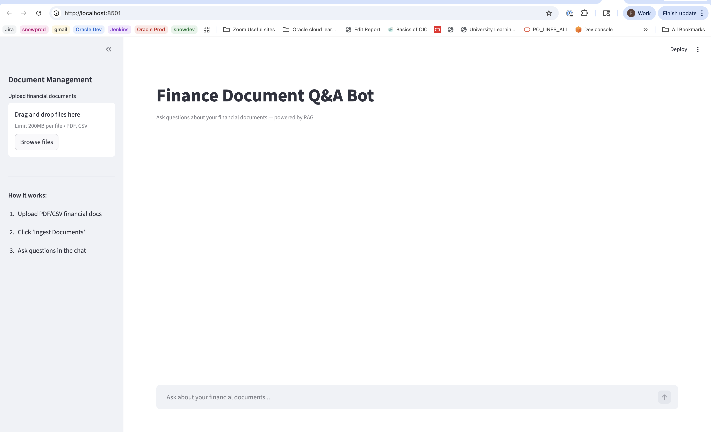
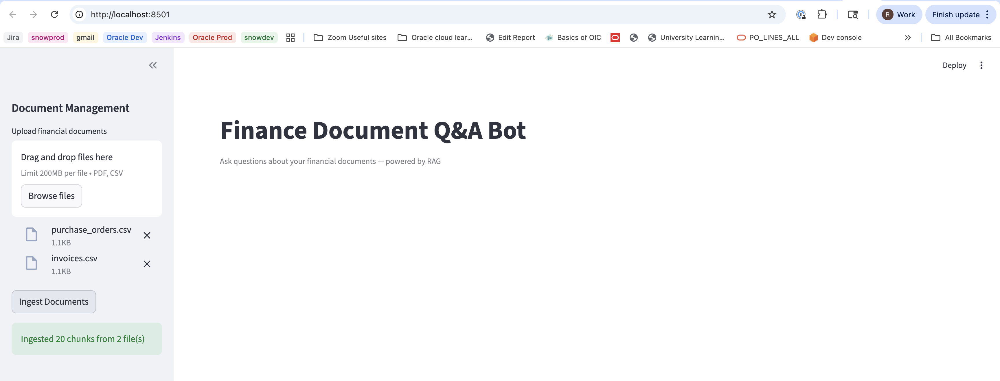
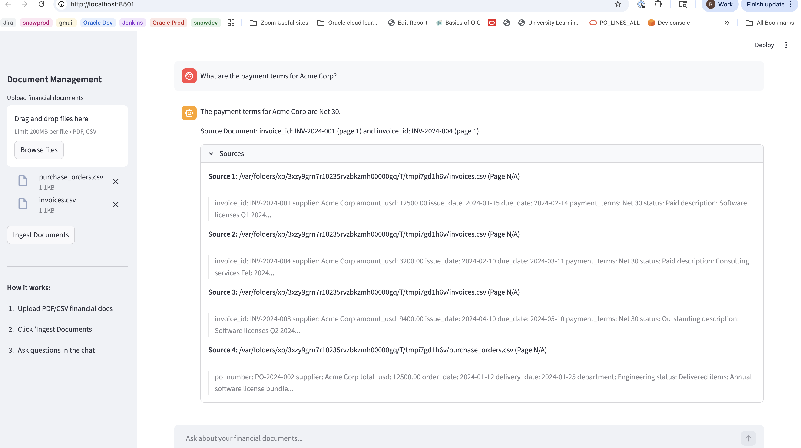
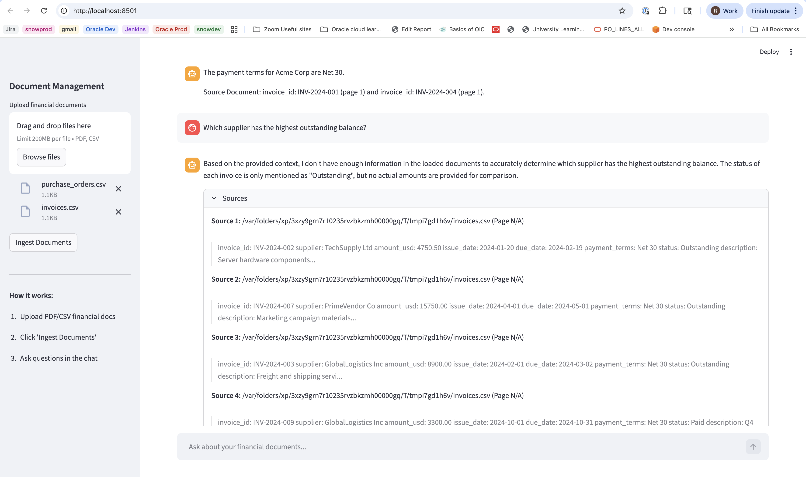
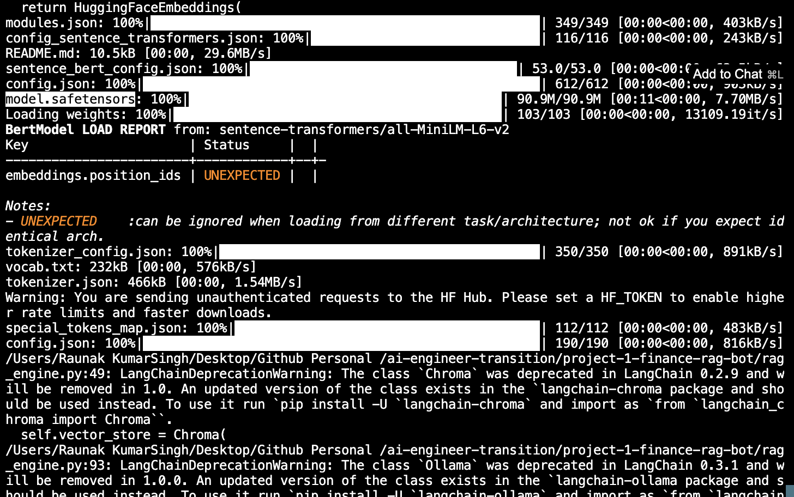

# Finance Document Q&A Bot (RAG Pipeline)

An AI-powered question-answering system for financial documents using Retrieval-Augmented Generation (RAG). Ask natural language questions about invoices, purchase orders, requisitions, and supplier data — get accurate, sourced answers.

## Architecture

```
┌─────────────┐     ┌──────────────┐     ┌─────────────┐     ┌──────────┐
│  Streamlit   │────▶│  RAG Engine   │────▶│  ChromaDB    │────▶│  LLM     │
│  UI          │     │  (retrieval)  │     │  (vectors)   │     │  (Ollama)│
└─────────────┘     └──────────────┘     └─────────────┘     └──────────┘
                           │
                    ┌──────┴───────┐
                    │  Document     │
                    │  Loader       │
                    │  (PDF/CSV)    │
                    └──────────────┘
```

## Features

- PDF and CSV document ingestion with intelligent chunking
- Vector embeddings stored in ChromaDB (local, no cloud costs)
- RAG pipeline: retrieves relevant chunks, feeds to LLM for grounded answers
- Source attribution: every answer cites the document and page it came from
- Streamlit web UI for interactive Q&A
- Runs 100% locally with Ollama (no API keys needed) OR with OpenAI API

## Tech Stack

| Component | Technology |
|-----------|-----------|
| Language | Python 3.12 |
| LLM | Ollama (llama3.2) or OpenAI API |
| Embeddings | sentence-transformers (all-MiniLM-L6-v2) |
| Vector Store | ChromaDB |
| Framework | LangChain |
| UI | Streamlit |
| Deployment | HuggingFace Spaces (free) |

## Quick Start

```bash
# Clone
git clone https://github.com/raunaksingh-ai/project-1-finance-rag-bot.git
cd project-1-finance-rag-bot

# Install dependencies
pip install -r requirements.txt

# (Option A) Run with Ollama (free, local)
ollama pull llama3.2
python app.py

# (Option B) Run with OpenAI API
export OPENAI_API_KEY=your_key_here
python app.py --provider openai

# Open browser at http://localhost:8501
```

## Project Structure

```
finance-rag-bot/
├── app.py                 # Streamlit UI entry point
├── rag_engine.py          # Core RAG pipeline
├── document_loader.py     # PDF/CSV ingestion and chunking
├── embeddings.py          # Embedding generation
├── config.py              # Configuration management
├── requirements.txt
├── sample_docs/           # Sample financial documents for demo
│   └── sample_invoice.pdf
├── .env.example
└── .gitignore
```

## How RAG Works (for your LinkedIn post)

1. **Ingest:** Financial documents (PDFs, CSVs) are loaded and split into chunks
2. **Embed:** Each chunk is converted to a vector embedding using sentence-transformers
3. **Store:** Embeddings are stored in ChromaDB (a local vector database)
4. **Query:** User asks a question in natural language
5. **Retrieve:** The question is embedded, and the most similar document chunks are retrieved
6. **Generate:** Retrieved chunks + question are sent to the LLM, which generates a grounded answer
7. **Cite:** The answer includes source attribution (document name, page number)

## Sample Questions

- "What is the total amount on invoice INV-2024-001?"
- "Which supplier has the highest outstanding balance?"
- "Show me all purchase orders from Q4 2025"
- "What are the payment terms for Acme Corp?"

## Demo Screenshots

**App UI**


**Document Ingestion — 2 CSV files, chunks stored in ChromaDB**


**RAG Answer with Source Attribution**


**Multi-document Reasoning**


**Local Model Running — zero API cost**


## License

MIT
